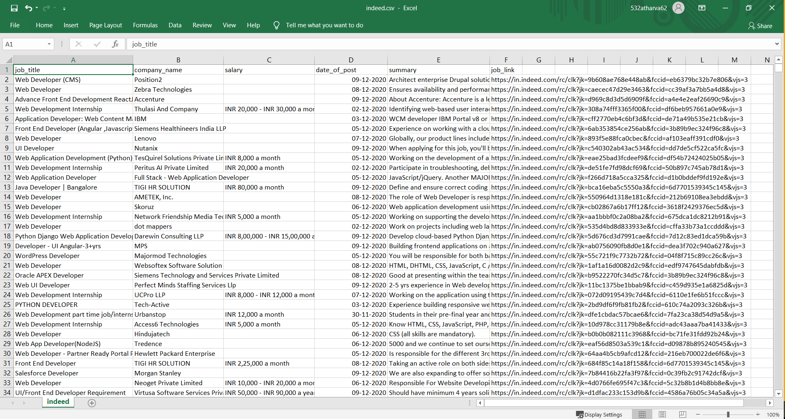

# Indeed Web Scraper 
            

* This is an Indeed Web Scraper used to job posting data from **Indeed** search page and stores that data into **.csv** file. We just have to enter the name of the job you are looking and it will give all the job posting information in the .csv file.
* This is a screenshot of .csv file.
    * 

## Features
---
* From each page it extracts each and every job posts` following information:   
    1. Job Title
    1. Company Name
    1. Location
    1. Salary
    1. Date of post
    1. Summary of job post
    1. Job post link

## Overview
---
* With the help of python script data scraping is done in this project. Python BeautifulSoup library does the major role in it. Along with that request library is also used. You can check entire code in scraple.py
* Csv package is used to store all the extracted data into Amazon.csv file.
* The project is done with and without the help of selenium package. 

